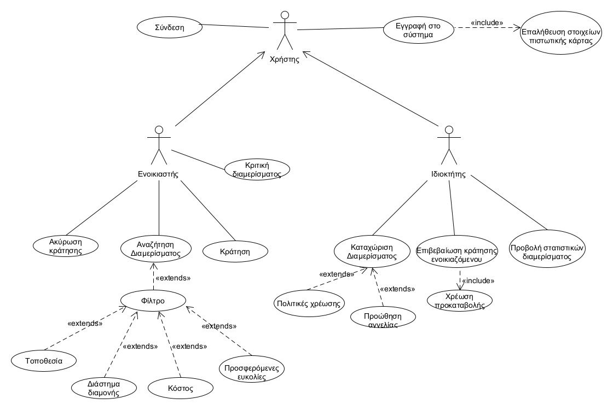

# Ομάδα 19 - Βραχυχρόνια ενοικίαση διαμερισμάτων

Η εφαρμογή θα επιτρέπει την ενοικίαση διαμερισμάτων σε διάφορες πόλεις για σχετικά μικρά χρονικά διαστήματα. Η καταχώριση των διαμερισμάτων θα γίνεται από τους ιδιοκτήτες τους μετά από εγγραφή τους στο σύστημα. Προϋπόθεση για ενεργοποίηση ενός εγγεγραμμένου χρήστη είναι η εισαγωγή έγκυρης πιστωτικής κάρτας, email και κωδικού πρόσβασης. Για να μπορεί να συνδεθεί ο χρήστης στην εφαρμογή επιτυχώς θα πρέπει να εισάγει τα κατάλληλα στοιχεία, τα οποία υπέβαλε κατά τη δημιουργία του λογαριασμού του. Ο ιδιοκτήτης διαμερίσματος θα μπορεί να καταχωρεί ένα διαμέρισμα εισάγοντας κατάλληλες πληροφορίες όπως διαστάσεις, όροφος, τοποθεσία, φωτογραφίες κτλ. Επιπλέον, εισάγει στοιχεία χρέωσης όπως ημερήσια χρέωση, ελάχιστος αριθμός ημερών παραμονής και κόστος καθαρισμού. Ο ιδιοκτήτης μπορεί να ορίσει διάφορες πολιτικές χρέωσης με ισχύ για συγκεκριμένες χρονικές περιόδους (μη επικαλυπτόμενες). Για κάθε διαμέρισμα είναι δυνατό να ορίζονται διαφορετικές πολιτικές χρέωσης. Επιπλέον η εφαρμογή θα παρέχει τη δυνατότητα στον ιδιοκτήτη να προβάλει το διαμέρισμά του σαν προωθημένη αγγελία με τη συνθήκη ότι η εφαρμογή θα κρατήσει extra προμήθεια.

Η εφαρμογή θα παρέχει δυνατότητα αναζήτησης διαμερισμάτων με διάφορα κριτήρια όπως τοποθεσία, διάστημα διαμονής, κόστος, προσφερόμενες ευκολίες (π.χ. Κουζίνα, κλιματισμός, wifi). Οι υποψήφιοι ενοικιαστές θα μπορούν να κάνουν κράτηση μετά την επιτυχή εγγραφή τους στο σύστημα. Η κράτηση θα επιβεβαιώνεται από τον ιδιοκτήτη και ο ενοικιαστής θα χρεώνεται μια προκαταβολή ίση με το 20% του κόστους. Ο ενοικιαστής θα μπορεί να αιτηθεί, οποιαδήποτε στιγμή, την ακύρωση μιας κράτησης. Αν το αίτημα υποβληθεί 30 ή λιγότερες ημέρες από την έναρξη της διαμονής ο ενοικιαστής θα χρεώνεται με 5% του κόστους διαμονής. Κάθε κράτηση θα επιβαρύνεται με σταθερή προμήθεια, η οποία θα χρεώνεται στον ενοικιαστή και δεν θα επιστρέφεται σε περίπτωση ακύρωσης. Οι ενοικιαστές μετά τη διαμονή τους σε ένα διαμέρισμα θα μπορούν να το βαθμολογήσουν με μέγιστη βαθμολογία τα 5 αστέρια.

Το σύστημα θα παράγει στατιστικά στοιχεία προς τους ιδιοκτήτες όπως μέση πληρότητα διαμερισμάτων ανά μήνα, έσοδα ανά μήνα και ανά διαμέρισμα, ακυρώσεις ανά μήνα.

## Επισκόπηση μοντέλου περιπτώσεων χρήσης

