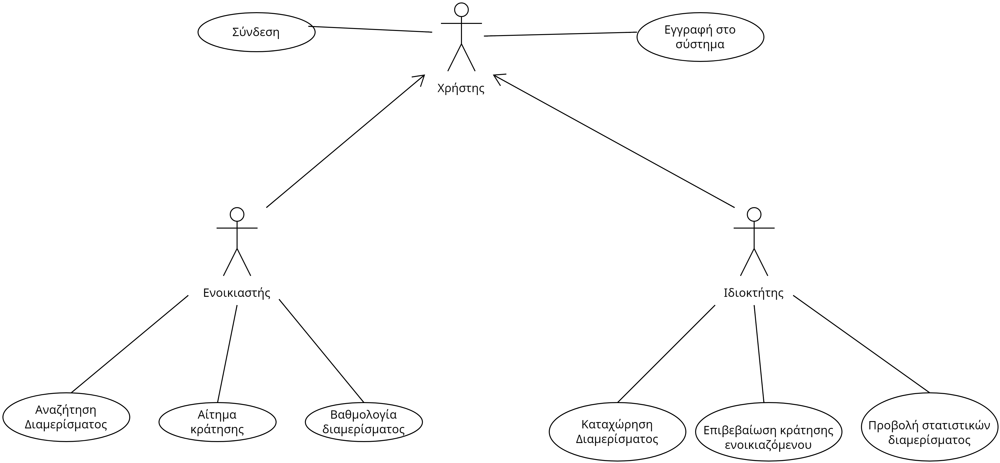

# Ready-Set-Home! - Βραχυχρόνια ενοικίαση διαμερισμάτων (Ομάδα 19)

Η εφαρμογή θα επιτρέπει την <b>ενοικίαση διαμερισμάτων σε διάφορες πόλεις</b> για σχετικά μικρά χρονικά διαστήματα. Η καταχώριση των διαμερισμάτων θα γίνεται από τους ιδιοκτήτες τους μετά από εγγραφή τους στο σύστημα. Προϋπόθεση για ενεργοποίηση ενός εγγεγραμμένου χρήστη είναι η εισαγωγή <i>έγκυρης πιστωτικής κάρτας, email και κωδικού πρόσβασης</i>. Αφού ο χρήστης πραγματοποιήσει επιτυχημένα την εγγραφή του στο σύστημα, αποκτά ένα μοναδικό id (ιδιοκτήτη ή ενοικιαστή αναλόγως με το τι είδους λογαριασμό αποφάσισε να δημιουργήσει) και καταχωρείται στο σύστημα μαζί με την ημερομηνία που πραγματοποίησε την εγγραφή. Για να μπορεί να συνδεθεί ο χρήστης στην εφαρμογή επιτυχώς θα πρέπει να εισάγει τα κατάλληλα στοιχεία, τα οποία υπέβαλε κατά τη δημιουργία του λογαριασμού του. Ο ιδιοκτήτης διαμερίσματος θα μπορεί να <b>καταχωρεί</b> ένα διαμέρισμα εισάγοντας κατάλληλες πληροφορίες όπως <i>διαστάσεις</i>, <i>όροφος</i>, <i>τοποθεσία</i> και <i>φωτογραφίες</i>. Επιπλέον, εισάγει στοιχεία χρέωσης όπως <i>ημερήσια χρέωση</i>, <i>ελάχιστος αριθμός ημερών παραμονής</i> και <i>κόστος καθαρισμού</i>. Ο ιδιοκτήτης μπορεί να ορίσει διάφορες πολιτικές χρέωσης με ισχύ για συγκεκριμένες χρονικές περιόδους (μη επικαλυπτόμενες). Για κάθε διαμέρισμα είναι δυνατό να ορίζονται διαφορετικές πολιτικές χρέωσης οι οποίες ελέγχονται από το σύστημα σε περίπτωση που ο χρήστης αποφασίσει να ορίσει τιμές που ξεφεύγουν από τα πλαίσια του διαμερίσματος (πχ να χρεώνει σε υψηλή τιμή ένα διαμέρισμα 40 τετραγωνικά σε μία περιοχή που οι τιμές τείνουν να είναι χαμηλές). Επιπλέον η εφαρμογή θα παρέχει τη δυνατότητα στον ιδιοκτήτη να προβάλει το διαμέρισμά του σαν προωθημένη αγγελία με τη συνθήκη ότι η εφαρμογή θα κρατήσει extra προμήθεια. Ο ιδιοκτήτης μπορεί επίσης να <b>ενημερώσει</b> ένα διαμέρισμα για πράγματα όπως την ημερήσια χρέωση, το κόστος καθαρισμού, τις φωτογραφίες κτλ., καθώς και τις πολιτικές χρέωσεις. Επίσης θα μπορεί να <b>διαγράψει</b> ένα, με την προϋπόθεση ότι θα ακυρώσει εκείνος τις κρατήσεις των ενοικιαστών, οπότε θα πάρουν όλα τους τα χρήματα πίσω.

Η εφαρμογή θα παρέχει δυνατότητα <b>αναζήτησης</b> διαμερισμάτων με διάφορα κριτήρια όπως τοποθεσία, <i>διάστημα διαμονής</i>, <i>κόστος</i>, <i>προσφερόμενες ευκολίες</i> (π.χ. Κουζίνα, κλιματισμός, wifi). Για πιο εύκολη αναζήτηση ο ενοικιαστής θα μπορεί να φιλτράρει τις επιλογές που του ταιριάζουν. Οι υποψήφιοι ενοικιαστές θα μπορούν να κάνουν κράτηση μετά την επιτυχή εγγραφή τους στο σύστημα. Η κράτηση θα επιβεβαιώνεται από τον ιδιοκτήτη και ο ενοικιαστής θα χρεώνεται μια <b>προκαταβολή ίση με το 20%</b> του κόστους. Αφού γίνει η επιβεβαίωση της κράτησης για κάποιον ενοικιαστή, το σύστημα θα ανανεώνει τη διαθεσιμότητα του διαμερίσματος ώστε να εμφανίζεται κατειλημμένο για το ανάλογο χρονικό διάστημα. Ο ενοικιαστής θα μπορεί να αιτηθεί, οποιαδήποτε στιγμή, την ακύρωση μιας κράτησης. Αν το αίτημα υποβληθεί 30 ή λιγότερες ημέρες από την έναρξη της διαμονής ο ενοικιαστής θα <b>χρεώνεται με 5% του κόστους διαμονής</b>. Κάθε κράτηση θα επιβαρύνεται με σταθερή προμήθεια, η οποία θα χρεώνεται στον ενοικιαστή και δεν θα επιστρέφεται σε περίπτωση ακύρωσης. Οι ενοικιαστές μετά τη διαμονή τους σε ένα διαμέρισμα θα μπορούν να το βαθμολογήσουν με μέγιστη βαθμολογία τα 5 αστέρια.

Το σύστημα θα παράγει στατιστικά στοιχεία προς τους ιδιοκτήτες όπως μέση πληρότητα διαμερισμάτων ανά μήνα, έσοδα ανά μήνα και ανά διαμέρισμα, ακυρώσεις ανά μήνα. Τα δεδομένα για την πληρότητα και τα έσοδα των διαμερισμάτων συλλέγονται από τη στιγμή που γίνει η επιβεβαίωση της κράτησης από τον ιδιοκτήτη, 
και για την ακύρωση των διαμερισμάτων αφού ο ενοικιαστής κάνει ακύρωση κράτησης και απελευθερωθεί το διαμέρισμα. Αξίζει να σημειωθεί ότι η ακύρωση μίας κράτησης επηρεάζει την πληρότητα του διαμερίσματος.

## Επισκόπηση μοντέλου περιπτώσεων χρήσης

